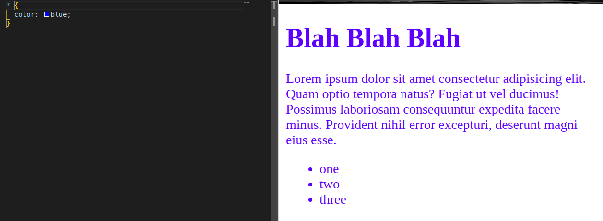
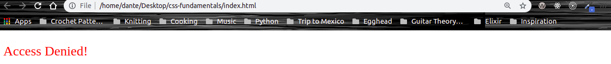

# CSS Fundamentals

## 2. Use Selectors to Style HTML Elements

CSS gives us the ability to work with many different types of selectors to target and style HTML elements.

The first way that we can target and style an element is with a **Type selector**. Type selectors match the provided node. A **node** is simply an HTML element. Once you move on to JavaScript and start learning about the DOM (Document Object Model), you'll see this word pop back up again.

```CSS
  h1 {
    color: blue;
  }
```

All the `h1` elements within the scope of this CSS will have a blue color.

There is also a selector that allows us to affect every element on the page, the `*` (**universal selector**). When using this selector the browser has to apply this CSS declaration to every element where this declaration is valid.

```CSS
  * {
    color: blue;
  }
```
Notice how every element on the page is now blue:



The third type of selector is the **class selector**. This selector will apply styling to any HTML element that has the `class` attribute.

```HTML
<p>Do you like <span class="highlight">green</span> eggs and ham?</p>
```

Now we can use the name that we assigned to our class attribute in our external stylesheet as our class selector :

```CSS
.highlight {
  color: green;
}
```
**Important tip:** remember to always place the `.` before the name of your class selector or else your CSS declaration won't take effect.

This will be the expected result:


The fourth type of selector is the **id selector**. This selector will apply styling to any HTML element that has the `id` attribute.

```HTML
  <p id="error">Access Denied!</p>
```

Now we can use the name that we assigned to our id attribute in our external stylesheet as our id selector :

```CSS
#error {
  color: red;
}
```
**Important tip:** remember to always place the `#` before the name of your id selector or else your CSS declaration won't take effect. Also remember that ids should be unique to the page, meaning there should not be multiple elements with the same name for the id attribute. If you need multiple elements to have the same styling use the same class name instead. If you want a more indepth explination of when to use classes vs ids check out this article on [CSS-Tricks](https://css-tricks.com/the-difference-between-id-and-class/).

This will be the expected result:



And last but not least there is the **attribute selector**, and as the name implies it allows you to use the attribute as a selector but with a slighty different syntax.

```HTML
<p data-error="error">Access Denied!</p>
```

Now we can use the attribute that we assigned to our p element in our external stylesheet as a selector :

```CSS
[data-error="error"] {
  color: red;
}
```

**Important tip:** remember to the place the attribute selector in braces or else your CSS declaration won't take effect.

If would like to look a little closer at the attribute that we used above, [w3schools](https://www.w3schools.com/tags/att_global_data.asp) has a great article on it.

Also ther attributes provided to HTML elements can be targeted as well by copying the attribute and placing it within square brackets.