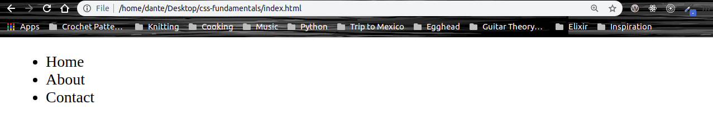
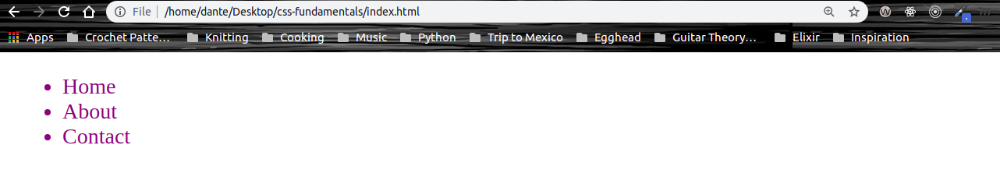
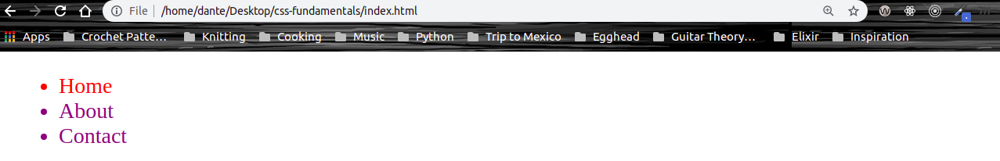
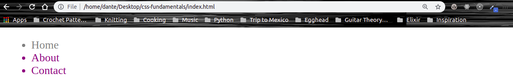
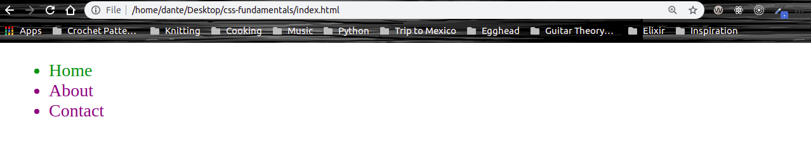
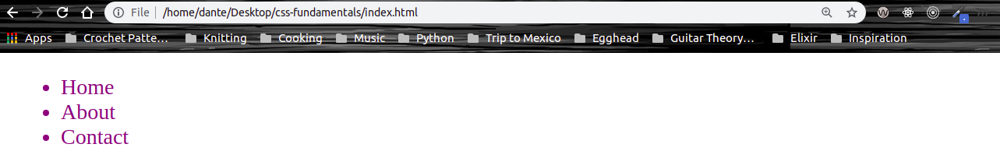

# CSS Fundamentals

## 3. Utilize Selector Specificity to Control Applied Styles

When selectors conflict, meaning you could have mulitple selectors targeting the same element(s) on the page, the browser needs to know which `property: value` combination to apply. **Specificity** is one of the core concepts of CSS and is important to understand in order to implement _deterministic_ (a process whose resulting behavior is entirely determined by its initial state and inputs, and which is not random) styles.

Say for instance we wanted to target all the `li` elements in an `ul` (**unordered list**) in our HTML document,

```HTML
<ul>
  <li>Home</li>
  <li>About</li>
  <li>Contact</li>
</ul>
```



We can do so by using the type selector for our `li` elements:

```CSS
li {
  color: purple;
}
```

Now all the `li` elements on our page should be purple:



**Fun fact:** an unordered list is used as the navagation bar to hold the different links to your site. You can use CSS to style it and make it look like the navigation bars that you are used to seeing on other sites such as Facebook, Apple, Twitter etc. Check out this awesome tutorial from [w3schools](https://www.w3schools.com/css/css_navbar.asp).

Now things get really intersting when we add a conflicting style to one of our `li` elements. Let's add the class `home` to our first `li` element:

```HTML
<li class="home">Home</li>
```

Now we can target that class by using `.home` class selector in our external stylesheet:

```CSS
li {
  color: purple;
}
.home {
  color: red;
}
```



Notice how the remaining `li` elements remain blue while the first `li` element that we assigned the class `home` is now red. This is where the **specificity** of our CSS delcarations play a critical role.

When multiple selectors are targeting the same element, the browser needs to know which one to apply. This is where the cascade and specificity come into play.

**Type selectors** have a specificity value of `0,0,1`, while **class selectors** have `0,1,0`. Because class selectors are greater than element selectors in value, the `.home` class selector is going to overrule the `li` type selector. That's why in our example above the first `li` element is now red.

Now let's give our `li` element with the class of `home` and id of `home`:

```HTML
<li class="home" id="home">Home</li>
```

Now we'll target this id selector in our external stylesheet:

```CSS
li {
  color: purple;
}

.home {
  color: red;
}

#home {
  color: grey;
}
```



Now you'll notice that our first `li` element is now grey. This is because **id selectors** have a sepcificity of `1,0,0`, making it greater in specifity than both the type selector and class selector.

Even if we added more targeted type selectors to our first CSS declaration, for example `ul` `li`:

```CSS
ul li {
  color: purple;
}

.home {
  color: red;
}

#home {
  color: grey;
}
```

The id selector still wins, because the id selector's value of `1,0,0` is larger than a type selector with two elements `0,0,2`, so the first `li` element will still remain grey.

There's also another way to style elements that has an even greater speceficity and that is with **inline CSS**. That is accomplished by adding the **style** attribute to an HTML element and then adding the CSS declaration inside of the `" "` without the curly braces:

```HTML
<li class="home" id="home" style="color: green">Home</li>
```



**Important tip:** When adding multiple CSS properties to your `style` atrribute be sure to separate them with a `;` or else your CSS declaration won't take effect.

Now the first `li` element is now green thanks to our inline CSS declaration. The CSS declarations made in our inline `style` attribute will always beat out id, class, and type selectors.

Last but not least we have something that even beats out inline styles and that is the `!important` tag. If we got back to our external stylesheet and add `!important` to the value of our property, this styling wil take precedence.

```CSS
ul li {
  color: purple !important;
}

.home {
  color: red;
}

#home {
  color: grey;
}
```



Now you'll notice that after applying the `!important` tag to our first CSS declaration in our external stylesheet that our first `li` element is now purple again. That is because `!important` will always take precendence over the property and element that it is assigned to.

**Important tip:** Always be sure to add the `!important` tag before the `;`, or the styling of the tag won't take effect.

And just in case you have a hard time remembering specificity just remember this:

```
!important > inline style > id selector > class selector > type selector
```
