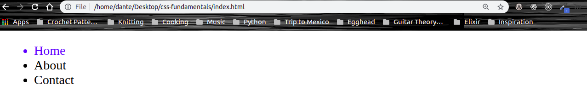

# CSS Fundamentals

## 4. Style Elements Using the Cascade

It can be frustrating working with CSS elements when the elements on your page are not styling correctly because there is a conflicting style lower in the stylesheet. This is due to the **cascading** feature of our CSS (Cascading Stylesheet).

Let's say we wanted to style all our `li` elements to be the color red:

```CSS
li {
  color: red;
}
```


Now what happens if we add an additonal CSS declaration below our first declaration with the color blue?:

```CSS
li {
  color: red;
}

li {
  color: blue;
}
```


Now you'll see that all the `li` elements are now blue, despite the color being set to red in the first CSS declartion of our stylesheet. The reason this is valid is thanks to the cascading feature of CSS which determines what gets displayed in the broswer based off the source order or how we define our styles.

When styles conflict like our example above, the browser will look at specificity, and then it will look at the order of CSS declarations. Since the two `li` elements defined above have the same level of specificity, the CSS declaration for the `li` element that comes last in the stylesheet will take precendence which why our `li` elements are now blue. But remember, this only applies to the CSS declarations that have the same selector with the same level of specificity.

This same rule applies for class selectors as well. If you have two CSS declarations with the same class selector, the browser is going to see that they have the same level of specificity and then it's going to check to see which declaration is last in the stylesheet and that declaration will take precedence.

```HTML
<ul>
      <li class="home home--two">Home</li>
      <li>About</li>
      <li>Contact</li>
</ul>
```

```CSS
.home {
  color: red;
}

.home--two {
  color: blue;
}
```



Notice how the color of the `li` element is blue. That's because the class selector `.home--two` is lower on the cascade. Even if you switched the order of the class names in the `class` attribute of our HTML document:

```HTML
<li class="home--two home">Home</li>
```

The `li` element will still be blue because of the order in which they were defined in the stylesheet.
