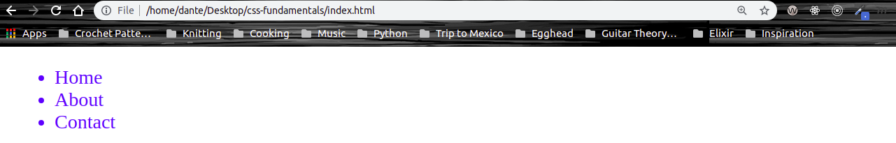
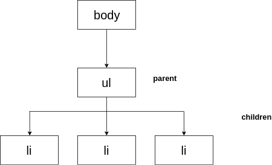
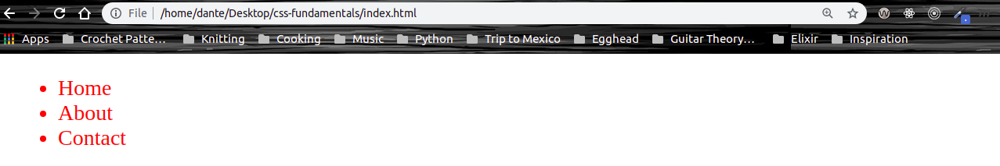
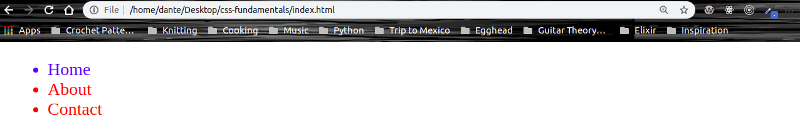
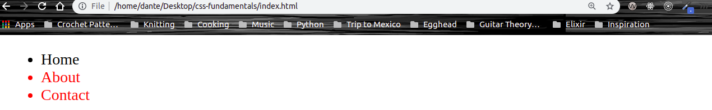

# CSS Fundamentals

## 5. Apply CSS Styles with Inheritance

The cascade of CSS is frequently combined with the concept of inheritance. These two topics are related, however, you should try to understand each individually.

Let's apply the color blue to the `ul` element and see how it affects the child `li` elements:

```CSS
ul {
  color: blue;
}
```



You'll noticed that now all of our `li` elements are now blue. This is due to what is called **inheriatnce**, meaning that some styles are carried to the child elements within the HTML tree. And just as the name implies we can think of our HTML document like we would a family tree with parents, children, and siblings.

Here's an example of how our current HTML document would be represented as an HTML tree:

```HTML
<!Doctype html>
<html>
  <head>
    <link rel="stylesheet" href="styles.css">
  </head>
  <body>
    <ul>
      <li>Home</li>
      <li>About</li>
      <li>Contact</li>
    </ul>
  </body>
</html>
```



Remember that everything within the `body` tag is what gets displayed in our browser.

Most of the accepted inherited properties involve text, such as `color`, `font`, `font-family`, `font-size` and so on, while properties that do not are those like `padding`, `margin`, `height`, and `width`.

We can also control inheritance:

```CSS
ul {
  color: blue;
}

li {
  color: red;
}
```



The CSS declaration for our `li` elements was able to override the color blue that was inherited from their parent `ul` element.

There is another value of `inherit` that allows you inherit the value of the property of the parent element:

```HTML
<li class="home">Home</li>
```

```CSS
ul {
  color: blue;
}

li {
  color: red;
}

.home {
  color: inherit;
}
```



You'll notice that now the first `li` element with the class name `home` is inheriting the color blue from its parent `ul` element.

We can also use the property value `initial`. `initial` sets the property value to be the same as the value set for that element in the browser's default style sheet. `initial` is not supported in Internet Explorer, but is supported in all of the other browsers.

```CSS
.home {
  color: initial;
}
```



You'll notice that now the first `li` element has been set back to the color of the browser's default stylesheet which is black.
