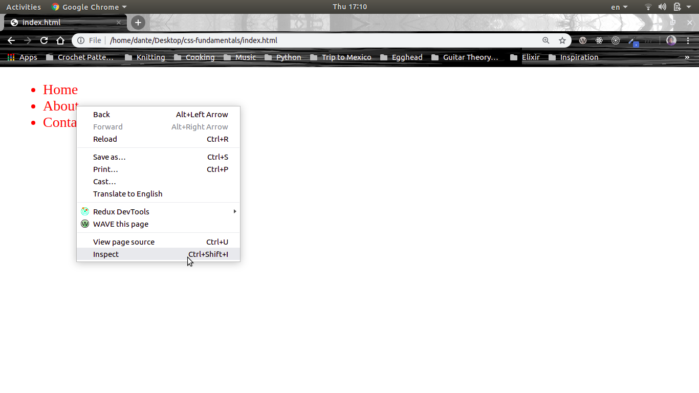
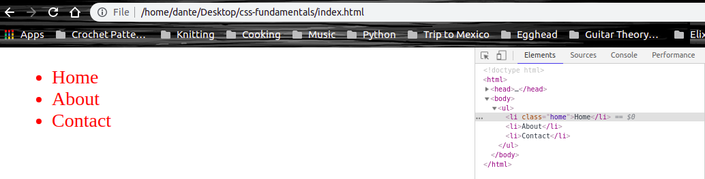
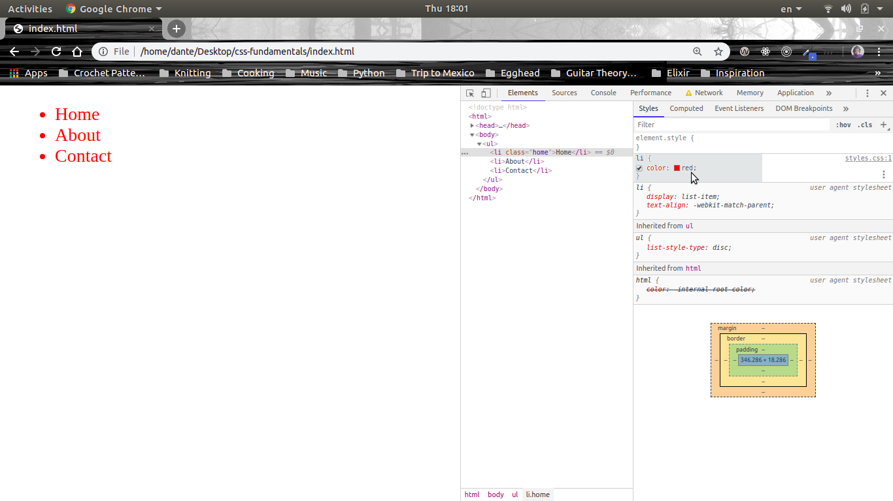
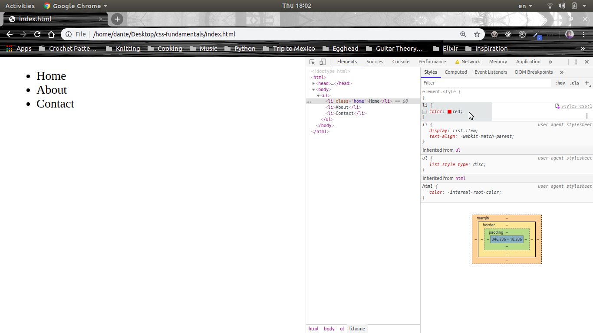
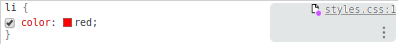
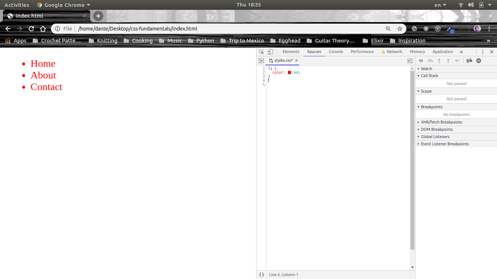

# CSS Fundamentals

## Debug CSS with the Chrome Devtools

CSS can be hard to understand. It can be frustrating when you expect the element to be styled one way and it doesn't work as expected. Luckily our browsers like Chrome, come with devtools we can use to see which styles are overriding and which have issues.

We can see some of the tools that Chrome gives us by right-clicking on the element we want to inspect

When you use that inspect option, Chrome will take us to where the selected HTML lives inside of our HTML tree. Let's see what happpens when we inspect our first `li` element:

Notice how to the right in the **inspector** you see where the inpsected `li` element is located in the tree.

Within the `styles` tab, we can clearly see our `li` element is styled red.

The CSS declartaions in this tab are editable, which means we can remove this style by unchecking the box next to the property:

Now you see that the `li` elements are back to their default color of black. You can also add other properties as well just as you would in the stylesheet, and the changes will take place automatically right in the browser.

**Important tip:** the changes that you make in the styles tab of the `inspector` devtool won't actually update your stylesheet and when you refresh the browser are your changes that you made in this tab will go away. But it's a cool way to test out styles before adding them to your stylesheet.

We see that `li` receives other styles from Chrome such as text align. It also gets these bullet point-type styles from Chrome, but it's being inherited from the `ul`. This is why the hierarchy order here is important.

What's also nice is that Chrome will tell us where it got the styles from:

We can see that in the case of our `li` element our style came from `styles.css`. If you click on the link it will actually open up your stylesheet in the inspector:

We can also add classes to our elements in the styles tab by clicking on `.cls`, which will open up an input box and allow us to type in the name of the call that we want to add to our element. Once we press the `+` here, it will give us a custom CSS declaration block where we can add properties onto our newly created class.

There's also `:hov` which lets you activate the `active`, `focus`, and `visited` pseudo classes when working with `a` tags.

The inpsector also shows us where our elements live inside the HTML tree.

Also if you look at the bottom right of the inpsector we are shown two things: the box model of the selected element and the final state of the styles of our element. We can manually add values to the box model by clicking on any of the dashes and typing.

The inspector is your best friend when you feel lost and want to know what styles are applied to the elements of your page.
